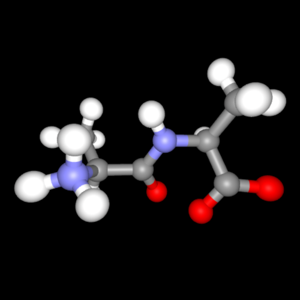
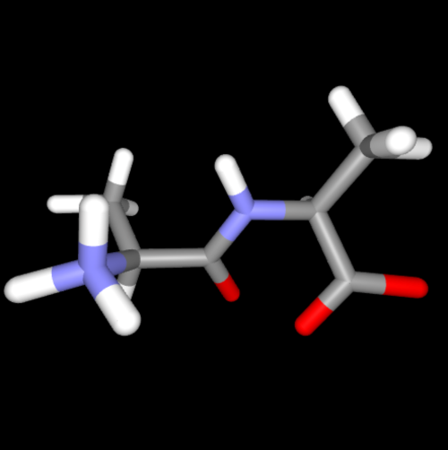

# Getting started


BiochemicalVisualization.jl provides graphical representations of molecular systems. In the following example, a sample structure is loaded through [BiochemicalAlgorithms.jl](https://github.com/hildebrandtlab/BiochemicalAlgorithms.jl) and prepared for visualization later on.

``` julia
using BiochemicalAlgorithms, BiochemicalVisualization

# Read PDB file from the BiochemicalAlgorithms.jl repository
sys = load_pdb(ball_data_path("../test/data/AlaAla.pdb"))

# Prepare molecule
fdb = FragmentDB()
normalize_names!(sys, fdb)
reconstruct_fragments!(sys, fdb)
build_bonds!(sys, fdb)
```

# Available representations

The following code examples showcase all currently available representations. Please note that, on this page, all interactive widgets are replaced by screenshots thereof. When executed locally, e.g., in a Julia REPL or in a Jupyter notebook, the code examples should open a browser window with the correpsonding widget or embed the widget into the notebook, respectively.

## Ball-and-stick representation

``` julia
ball_and_stick(sys)
```



Ball-and-stick representation of a simple molecule

## Stick representation

``` julia
stick(sys)
```



Stick representation of a simple molecule

## Van-der-Waals surface representation

``` julia
van_der_waals(sys)
```


Van-der-waals representation of a simple molecule with unit radii

Please note that the sphere radii are currently not automatically assigned by atom type but rather read from the corresponding `Atom` object (i.e., from its `radius` field).
